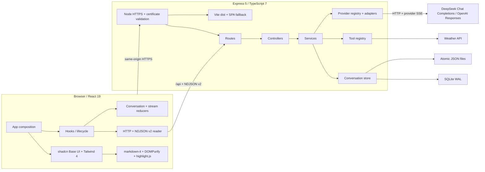
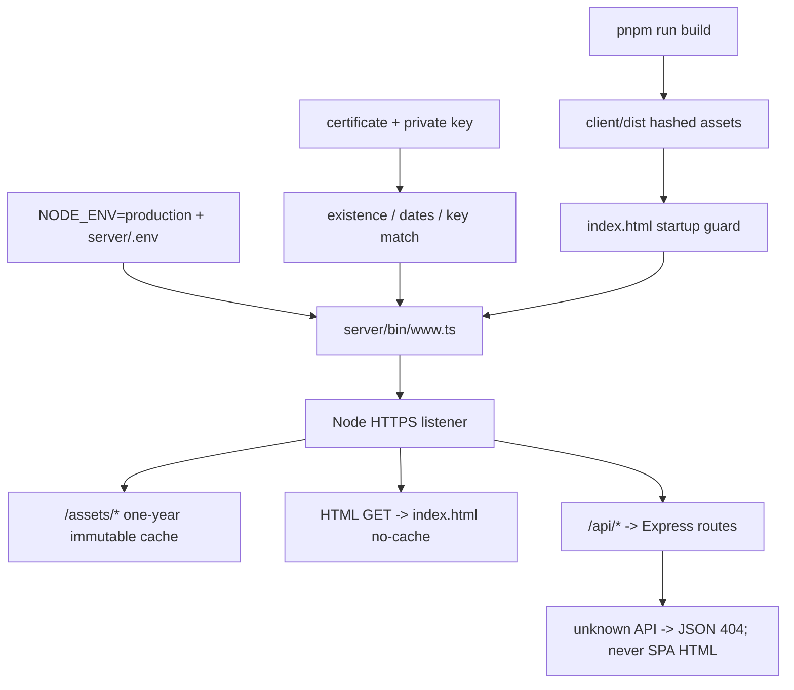
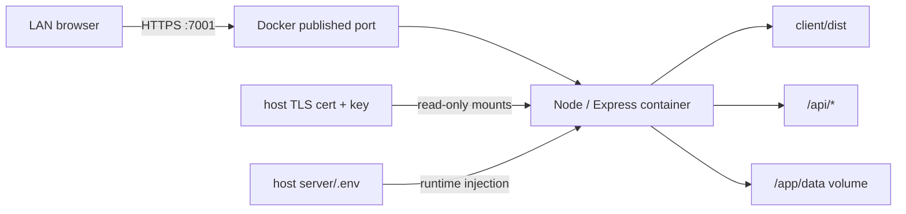
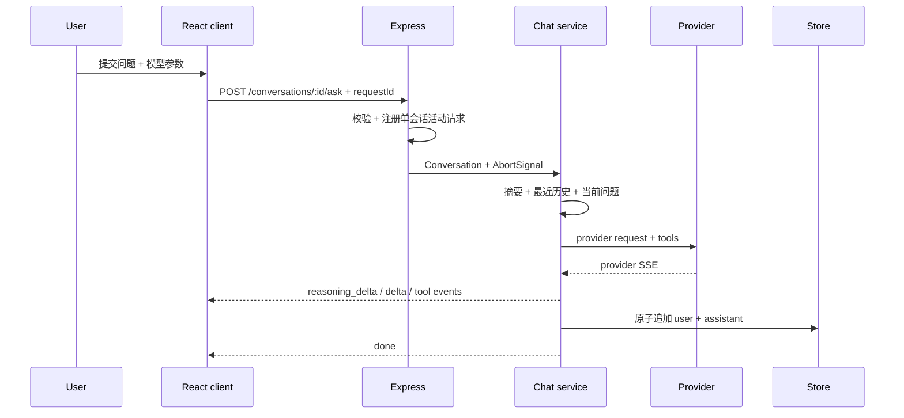
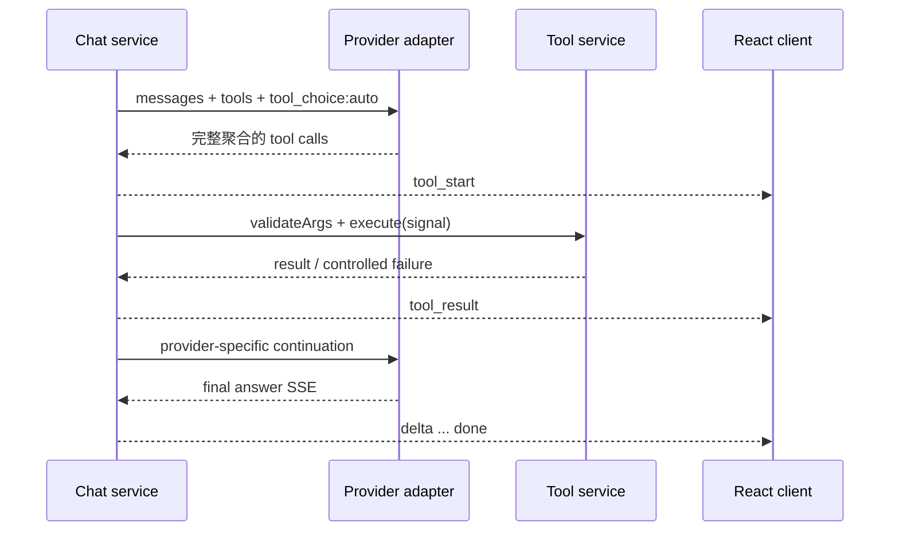
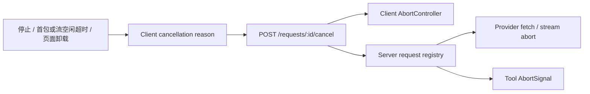

# Chatbot Architecture

本文描述 React-only 当前实现。项目定位是个人学习和内部使用，优先保证本地稳定、可调试和可回归，不扩展为多租户 SaaS 或通用 Agent 平台。

## 系统视图

## 前端边界

| 模块 | 职责 |
| --- | --- |
| `client/src/app/App.tsx` | 页面组合和高层事件连接，不承载底层协议逻辑 |
| `client/src/components/*` | 展示、交互、ARIA 与 shadcn 组件组合 |
| `client/src/hooks/useChatAppController.ts` | 单一页面装配入口：运行配置、聊天流、搜索、主题和各专责 hook 组合 |
| `client/src/hooks/useConversationOperations.ts` | 新建、切换、重命名、删除、清空和侧栏操作互斥 |
| `client/src/hooks/useConversationTransfer.ts` | 单会话 Markdown 导出、全量 JSON 导出和备份导入 |
| `client/src/hooks/useConversationInsights.ts` | 上下文预览、会话摘要及切换/生成竞态保护 |
| `client/src/hooks/useConversations.ts` | 会话列表、详情、选择序列和 CRUD |
| `client/src/hooks/useChatStream.ts` | requestId、AbortController、首包/流空闲超时、取消和恢复 |
| `client/src/hooks/useAutoScroll.ts` | 用户滚动意图、MutationObserver 和 rAF 跟随 |
| `client/src/reducers/*` | 不可变 conversation/stream 状态转换 |
| `client/src/api/*` | HTTP 错误读取、下载和 NDJSON 拆包 |
| `client/src/utils/streamProtocol.ts` | 基于共享事件联合执行 NDJSON v2 运行时校验 |
| `client/src/utils/markdownRenderer.ts` | 禁用 HTML/图片、净化、高亮和安全外链 |
| `client/src/utils/modelOptions.ts` | 运行时模型能力目录、损坏目录降级和参数约束 |

前端不解析 provider SSE、不读取 API key，也不直接操作持久化文件。

## 共享 TypeScript 工具链

- 根 `pnpm-workspace.yaml` 通过 catalog 为 client/server 单点锁定 TypeScript 7.0.2 和 Node 22 类型。
- 根 `tsconfig.base.json` 共享 `strict`、`noEmit`、`verbatimModuleSyntax`、side-effect import 和大小写一致性等通用规则。
- `client/tsconfig.*.json` 只保留 DOM/JSX、Bundler 解析和 Vite 类型；`server/tsconfig.json` 只保留 NodeNext、TS 扩展名导入和 erasable syntax 规则。
- workspace 只保留根 `pnpm-lock.yaml`，安装、CI 和生产审计都从仓库根目录执行。
- `shared/chatStreamProtocol.ts` 只承载 NDJSON v2 常量和判别联合，不引入运行时框架；client/server 均从该模块导入。

## 后端边界

| 模块 | 职责 |
| --- | --- |
| `server/routes/*` | 路由与静态/动态路径顺序 |
| `server/config/deploymentConfig.ts` | HOST/PORT、生产默认值、`~/` 路径和 TLS 证书/私钥校验 |
| `server/config/clientHosting.ts` | `client/dist` 校验、静态缓存与 HTML SPA 回退 |
| `server/controllers/*` | HTTP 输入、长度边界、状态码和流响应 |
| `server/services/chatService.ts` | 上下文、模型、工具两阶段、生成元数据聚合和完成/手动停止持久化 |
| `server/services/contextService.ts` | 摘要覆盖边界、安全截断、消息数和字符预算 |
| `server/services/conversationSummaryService.ts` | 摘要生成及会话变化检测 |
| `server/services/toolService.ts` | 工具参数校验、失败隔离、耗时和生命周期事件 |
| `server/tools/*` | 单工具 schema、validator 和 handler |
| `server/utils/llm/providerConfig.ts` | HTTP/HTTPS endpoint、凭据和默认模型 |
| `server/utils/llm/modelCatalog.ts` | 公共模型能力与禁用状态 |
| `server/utils/llm/adapters/*` | provider body、SSE 语义与 continuation |
| `server/utils/requestRegistry.ts` | requestId 与单会话活动请求互斥 |
| `server/utils/conversationStore.ts` | 稳定 facade；按运行配置选择 file/SQLite 实现并保持既有导出 |
| `server/utils/conversationStore/contracts.ts` | 存储公共契约和默认标题 |
| `server/utils/conversationStore/normalization.ts` | ID、消息、时间、摘要、标题和副本规范化 |
| `server/utils/conversationStore/migration.ts` | file/legacy aggregate 的共享迁移读取 |
| `server/utils/conversationStore/fileStore.ts` | 原子 JSON 文件、同会话 mutation queue 和 legacy file 迁移 |
| `server/utils/conversationStore/sqliteStore.ts` | SQLite schema/WAL、JSON 迁移、CRUD 和连接关闭 |

Provider 特有字段只存在于 adapter。控制器不拼 prompt，工具注册表不内嵌天气/计算器实现。

## 生产部署边界

- `NODE_ENV=production` 时默认启用 HTTPS 和前端构建托管；均可用显式环境变量覆盖。
- 生产 API 只位于 `/api/*`，避免会话 API 与 React 路由冲突。未托管前端的开发模式暂时保留根路径 API 兼容面。
- `index.html` 使用 `no-cache`；带 hash 的 `/assets/*` 使用一年 immutable cache。
- Node 直接终止 TLS；若改由反向代理终止 TLS，应显式设置 `HTTPS_ENABLED=false`，并只在受控网络内暴露 Node 端口。
- 当前项目没有登录或多用户隔离，不能仅因启用 HTTPS 就视为适合公开互联网访问。

### Docker 单容器拓扑

- Docker 不改变应用模块边界：镜像只负责封装 Node、server 生产依赖和 `client/dist`。
- Node 仍是唯一 HTTPS 与应用进程，不增加反向代理或第二套前端服务。
- `server/.env`、TLS 文件和会话数据均不进入镜像层；容器可替换，运行配置和数据独立保留。
- Compose 只运行一个实例。file store 的队列和 SQLite 写入边界都是单进程语义，不支持横向扩容。
- 完整镜像分层和生命周期见 [Docker 部署说明](docker-deployment.md)。

## 普通问答时序

完整模型回答写入 user + `completed` assistant；只有用户显式停止且已经收到正文时，才写入 user + `stopped` assistant。DeepSeek 必须读到 `[DONE]`，OpenAI Responses 必须读到 `response.completed`；正文、reasoning 或工具参数之后异常 EOF 仍通过现有 NDJSON `error` 结束，不发送 `done`，也不落库。若会话在生成期间被删除，同样返回流错误而不是把“成功”但未落盘的结果交给前端。

assistant 的可选 `generation` 保存 provider、model、finish reason、首 token 延迟、总耗时和 Provider usage；多阶段工具调用只聚合所有已完成请求共同提供的 usage 字段。可选 `toolTrace` 只保留裁剪后的工具名、成功状态、耗时和可读摘要。file store 直接写入兼容 JSON，SQLite 继续把 messages 保存为 JSON，因此不提升备份 schema 或数据库表结构。

存在会话摘要时，`summary.sourceMessageCount` 先安全截断到 `0..messages.length`，上下文窗口只在该边界之后的原始消息中按消息数和字符数选择最近后缀。上下文预览同时返回摘要覆盖数、摘要后消息数和最终选择的会话消息序号范围，便于确认摘要历史没有重复进入模型。

## Function Calling

- DeepSeek continuation 使用 assistant `tool_calls` + `tool` messages。
- OpenAI continuation 重放 Responses output items，并以 `call_id` 关联 `function_call_output`。
- OpenAI 使用 `store:false`，不依赖 provider 端历史。

## 取消与超时

- 客户端超时从发起 fetch 前开始，因此覆盖“迟迟没有响应头”。
- 同一 requestId 只取消一次；请求结束后清理取消集合、timer 和 refs。
- 后端同一会话只允许一个活动 ask，避免并行回答的语义和持久化竞态。
- 用户点击停止时先向服务端发送 `manual` 原因，再中止浏览器 fetch；服务端将已有正文保存为 `stopped`。取消请求最多等待 500ms，避免停止按钮因网络异常卡住。
- 超时、页面卸载和新建/切换会话分别标记原因；这些路径即使已有部分正文也不落库。
- `stopped` assistant 可刷新恢复，但会从后续原始上下文和新摘要中排除；异常 EOF 仍保持 R11 的“不落库”语义。

## 存储一致性

### File store

- 每个会话一份 JSON。
- 同一会话的 read-modify-write 进入串行 mutation queue，避免并发追加互相覆盖。
- 写入先落到同目录唯一临时文件，再 rename 替换，避免进程中断留下半份 JSON。
- 从文件读取时以文件名 ID 为准，防止 payload ID 串写其他文件。
- 损坏时间戳回退为有效 ISO 时间；非法临时文件名不会进入会话列表。

### SQLite

- 默认会话存储；可显式设置 `CONVERSATION_STORE=file` 回退到单会话 JSON 文件。
- WAL 模式；同步事务保证 migration 和批量写边界。
- messages/summary 以 JSON 保存，包含可选 generation/tool trace/status，对外保持与 file store 相同语义。
- 旧 JSON 迁移通过 metadata 标记实现幂等。

## 输入与错误边界

集中限制位于 `server/config/productLimits.ts`：自动标题、会话标题、搜索词、问题、导入会话数和单会话消息数。Provider endpoint 仅支持 HTTP/HTTPS；天气网络异常返回稳定可恢复错误；生产环境未处理的 5xx 不向客户端泄漏内部路径或上游细节。

## 扩展约束

- 新 provider：实现 `LlmAdapter`，登记 provider registry/model catalog，并补 adapter/真实协议 mock 测试。
- 新工具：新增独立 tool 文件，提供 schema、validator、handler 和 AbortSignal 测试。
- 新流事件：更新前后端判别联合、提升协议版本并补兼容测试。
- 新存储：实现现有 CRUD/导入/摘要/并发语义，不能只满足 happy path。

当前不增加新功能；本阶段只接受缺陷修复、回归覆盖、文档和维护性收敛。
