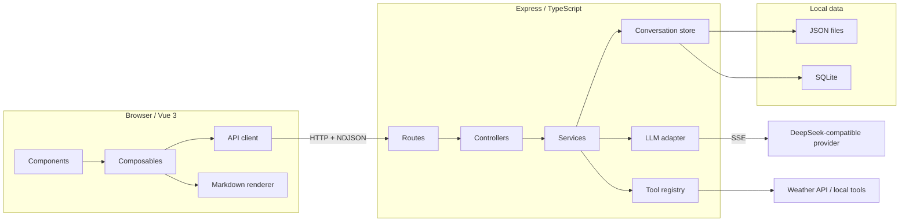
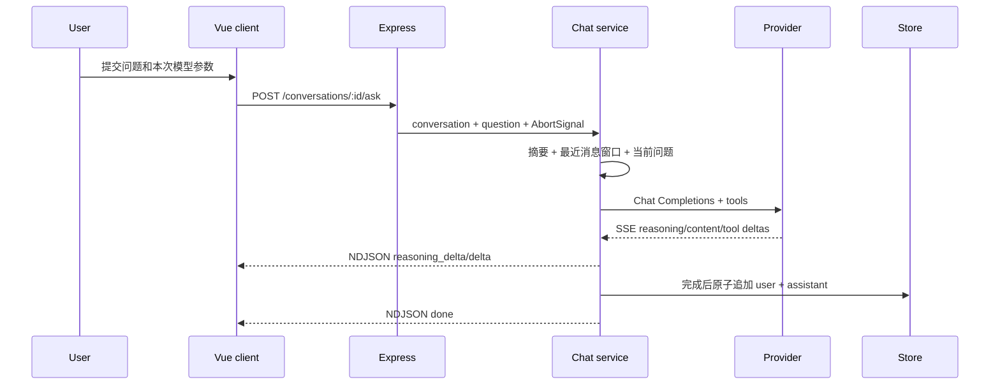
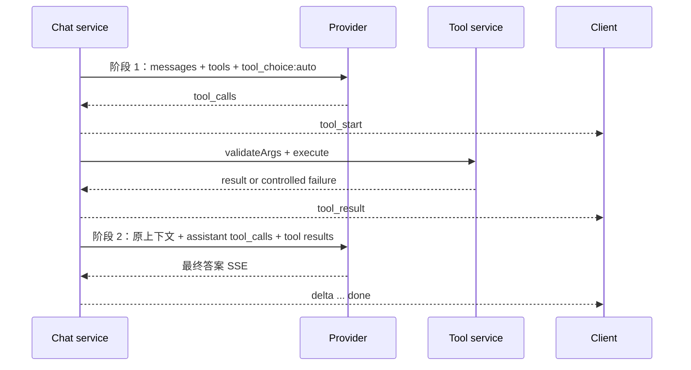

# Chatbot Architecture

本文档描述当前实现，不包含多用户、商业化或大规模平台化设想。项目定位是个人学习和内部使用，设计重点是本地稳定、可调试、可回归。

## 系统视图

## 模块边界

### 前端

| 模块 | 职责 |
| --- | --- |
| `client/src/App.vue` | 页面级组合、弹窗和高层事件编排 |
| `client/src/api/conversations.ts` | HTTP 契约、下载、导入、流式请求入口 |
| `client/src/composables/useConversations.ts` | 会话列表、详情和本地 UI 状态 |
| `client/src/composables/useChatStream.ts` | 请求生命周期、NDJSON 消费、中止、tool 状态 |
| `client/src/utils/streamProtocol.ts` | 协议版本和事件运行时校验 |
| `client/src/utils/markdownRenderer.ts` | Markdown 解析、净化、高亮和链接策略 |
| `client/src/utils/promptTemplates.ts` | 静态模板定义和变量替换 |

前端不直接理解 provider SSE，也不保存 API key。它只消费后端定义的应用协议。

### 后端

| 模块 | 职责 |
| --- | --- |
| `server/routes/*` | 路由注册和顺序 |
| `server/controllers/*` | HTTP 输入校验、状态码和响应格式 |
| `server/services/chatService.ts` | 上下文、模型、Function Calling、持久化编排 |
| `server/services/contextService.ts` | 最近消息窗口、字符预算和摘要合并 |
| `server/services/toolService.ts` | 工具注册、执行、失败隔离和生命周期事件 |
| `server/services/conversation*Service.ts` | 搜索、导入、导出、摘要等用例逻辑 |
| `server/utils/llm/*` | provider 适配、SSE 解析、超时和上游中止 |
| `server/utils/conversationStore.ts` | file/SQLite 存储适配与数据规范化 |
| `server/utils/ndjsonStream.ts` | 应用流式协议输出 |

控制器不拼 prompt，工具注册表不包含具体业务实现，provider 特有字段只存在于 adapter。

## 普通问答链路

只有模型完整完成且请求未中止时才持久化完整问答。停止生成保留前端已经收到的部分内容，但不会把不完整问答写入会话存储。

## Function Calling 两阶段

阶段 1 的普通 content 被缓冲，不会把模型的工具判断前导语泄漏到最终回答。reasoning 可持久化并回灌到阶段 2，但不会作为普通正文展示。

## 上下文与摘要

模型上下文由以下部分组成：

1. system prompt。
2. 可选的持久化会话摘要。
3. 最近历史消息，默认最多 20 条、12,000 字符。
4. 当前用户问题，始终完整保留。

窗口只影响发给模型的数据，不裁剪前端历史或存储。摘要由用户手动生成或重新生成，记录来源消息数和更新时间；清空会话时同步清空摘要。

## 数据存储

`conversationStore.ts` 对上层提供统一接口：

- `file`：每个会话一个 JSON 文件，支持旧聚合 JSON 迁移。
- `sqlite`：会话行保存消息 JSON 和摘要 JSON，启动时补齐旧库缺失字段。

全量 JSON 备份带 schema 版本。导入先完整校验，再按 `skip`、`duplicate` 或 `overwrite` 处理 ID 冲突，避免解析到一半产生部分写入。

## 扩展点

- 新 provider：实现 `LlmAdapter`，注册 provider，不把特有解析放进 controller。
- 新工具：新增独立 `server/tools/<name>Tool.ts`，包含 schema、参数校验和 handler，再加入注册表。
- 新流式事件：同时修改后端/前端判别联合、提升协议版本并补兼容测试。
- 新存储：实现现有 conversation store 语义，重点验证 CRUD、导入导出、摘要和迁移。

当前不需要抽象成通用多模型网关或 agent 平台；这些抽象会增加个人项目的维护成本，而不会改善当前学习目标。
