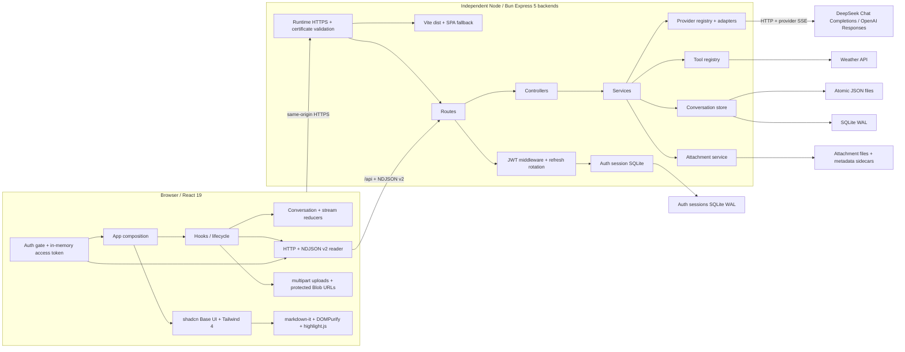
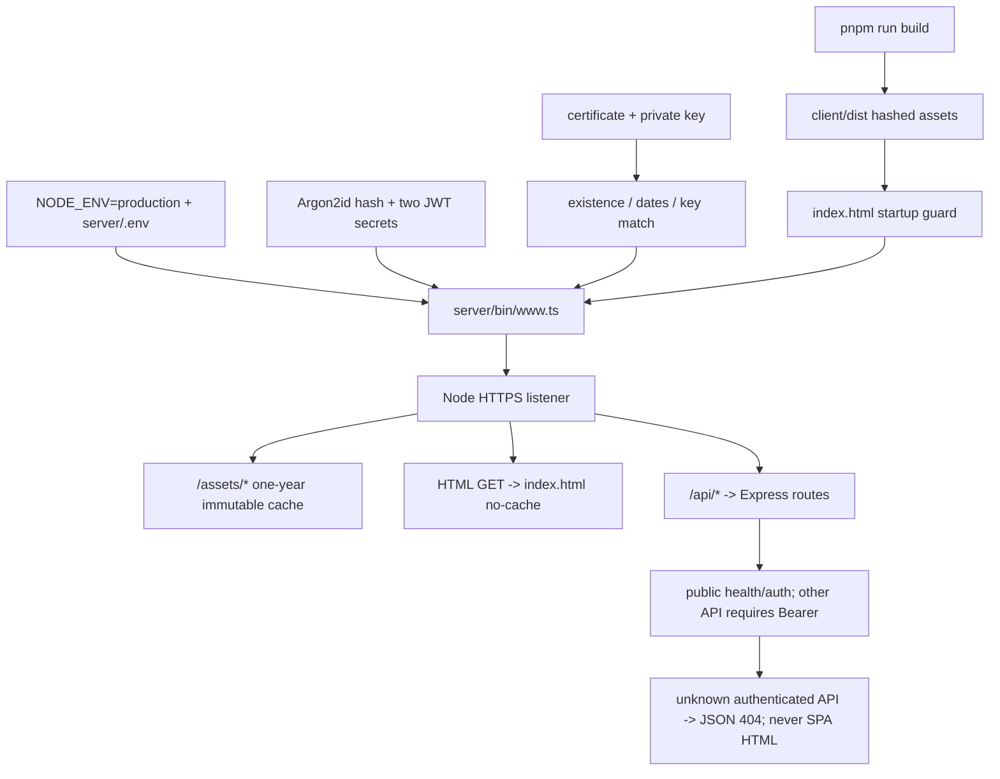
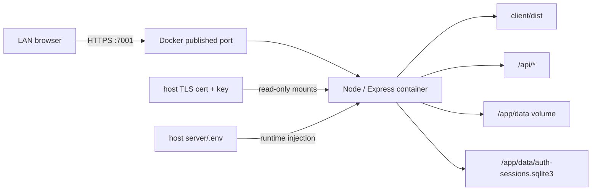
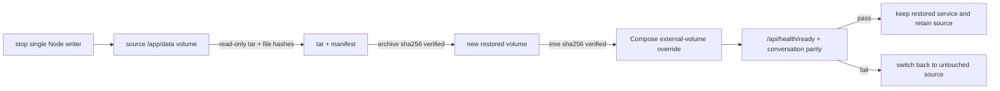
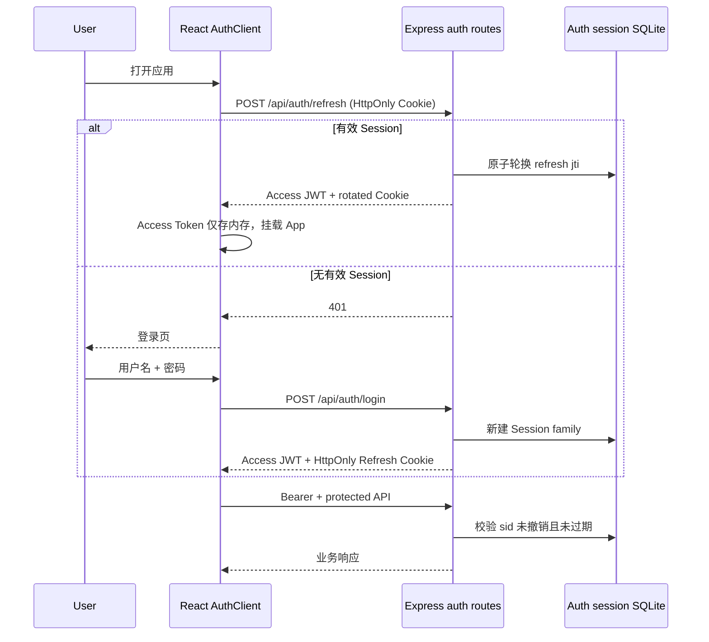
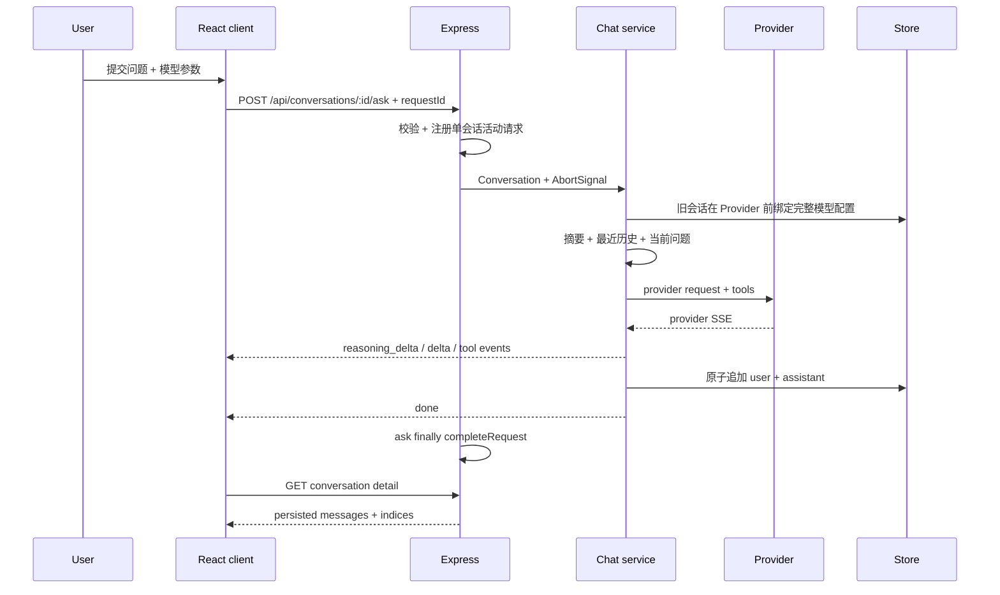
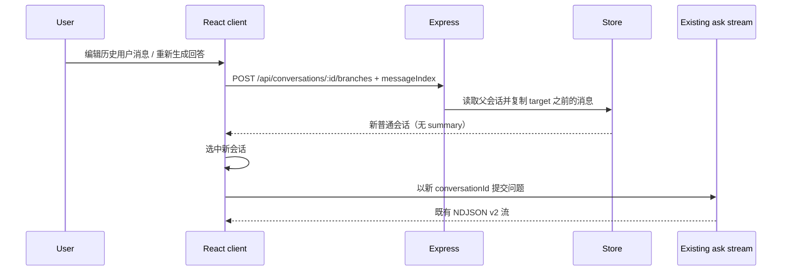
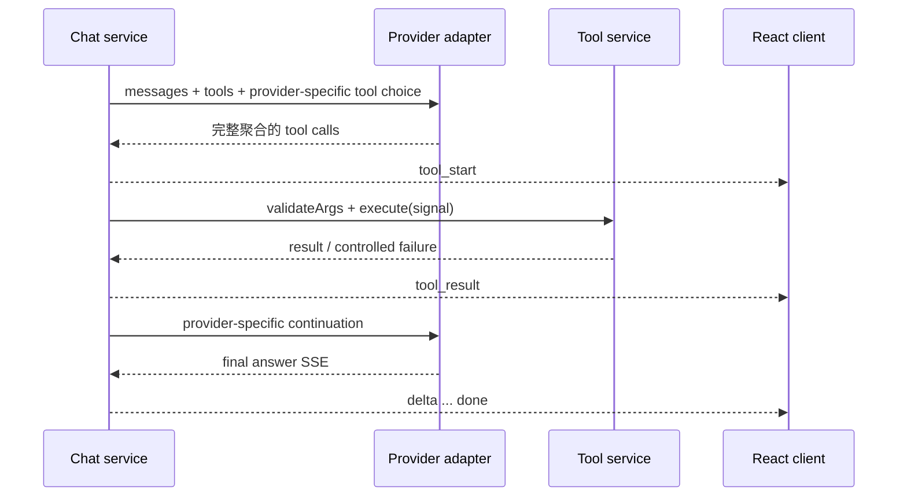
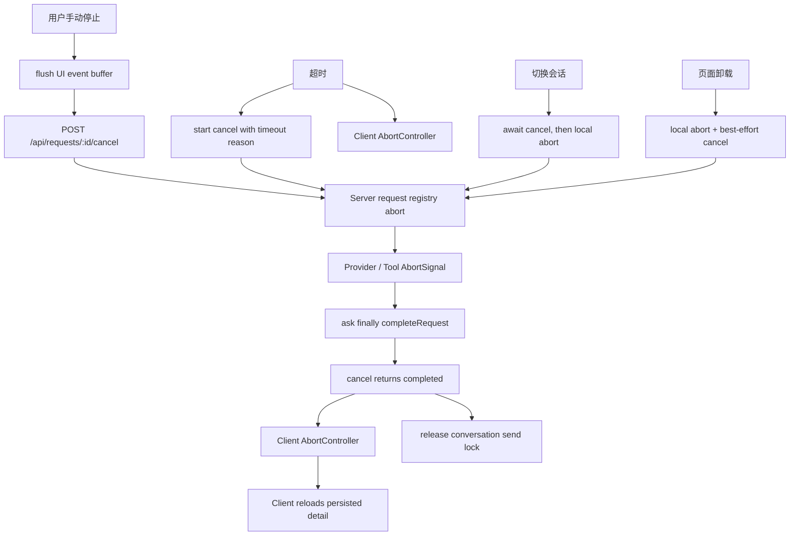

# Chatbot Architecture

本文描述 React-only 当前实现。项目定位是个人学习和内部使用，优先保证本地稳定、可调试和可回归，不扩展为多租户 SaaS 或通用 Agent 平台。

## 系统视图

## 前端边界

| 模块 | 职责 |
| --- | --- |
| `client/src/app/App.tsx` | 页面组合和高层事件连接，不承载底层协议逻辑 |
| `client/src/components/AuthGate.tsx` | 启动恢复和未登录门禁；认证成功前不挂载聊天 hooks |
| `client/src/auth/authClient.ts` | 内存 Access Token、Refresh 单飞、401 单次重放、定时刷新和跨标签页同步 |
| `client/src/api/httpClient.ts` | 为全部现有 API 统一附加认证语义，同时保留认证关闭兼容 |
| `client/src/components/*` | 展示、交互、ARIA 与 shadcn 组件组合 |
| `client/src/hooks/useChatAppController.ts` | 单一页面装配入口：运行配置、聊天流、搜索、主题和各专责 hook 组合 |
| `client/src/hooks/useConversationOperations.ts` | 新建、切换、重命名、删除、清空和侧栏操作互斥 |
| `client/src/hooks/useMessageBranching.ts` | 编辑/重新生成的目标定位、分支创建、新会话显式发送和失败恢复 |
| `client/src/hooks/useConversationTransfer.ts` | 单会话 Markdown、全量 schema v2 ZIP 下载以及 JSON/ZIP 备份导入 |
| `client/src/hooks/useImageAttachments.ts` | 当前会话图片选择、上传、预览 URL、删除/失败重试、切换清理和最多 4 张约束 |
| `client/src/hooks/useConversationInsights.ts` | 上下文预览、会话摘要及切换/生成竞态保护 |
| `client/src/hooks/useConversationModelOptions.ts` | 会话配置恢复、可用模型回退、乐观保存、失败回滚、快速点击和过期响应隔离 |
| `client/src/hooks/usePromptTemplates.ts` | 自定义 Prompt 模板的浏览器本地状态、localStorage 提交和跨标签页同步 |
| `client/src/hooks/useConversations.ts` | 会话列表、详情、选择序列和 CRUD |
| `client/src/hooks/useChatStream.ts` | requestId、AbortController、首包/流空闲超时、40ms 有界 UI 事件合并、取消完成握手和持久化详情回拉 |
| `client/src/hooks/useAutoScroll.ts` | 用户滚动意图、ResizeObserver、单一 rAF 跟随和快速到底状态 |
| `client/src/reducers/*` | 不可变 conversation/stream 状态转换，以及已保存消息的 `persistedIndex` 映射 |
| `client/src/api/*` | HTTP 错误读取、下载和 NDJSON 拆包 |
| `client/src/utils/streamProtocol.ts` | 基于共享事件联合执行 NDJSON v2 运行时校验 |
| `client/src/utils/chatStreamEventBuffer.ts` | 首段即时、相邻文本合并、容量上限、语义边界冲刷和生命周期清理 |
| `client/src/utils/markdownRenderer.ts` | 禁用 HTML/图片、净化、高亮和安全外链 |
| `client/src/utils/modelOptions.ts` | 运行时模型能力目录、会话配置恢复、损坏/失效模型降级、可发送性和参数约束 |
| `client/src/utils/customPromptTemplates.ts` | 自定义模板 schema v1、限制校验、非覆盖导入、导出和内置模板适配 |

前端不解析 provider SSE、不读取 API key，也不直接操作持久化文件。

## 共享 TypeScript 工具链

- 根 `pnpm-workspace.yaml` 通过 catalog 为 client/server/bun-server 单点锁定 TypeScript 7.0.2 和 Node 22 类型。
- 根 `tsconfig.base.json` 共享 `strict`、`noEmit`、`verbatimModuleSyntax`、side-effect import 和大小写一致性等通用规则。
- `client/tsconfig.*.json` 只保留 DOM/JSX、Bundler 解析和 Vite 类型；`server/tsconfig.json` 与 `bun-server/tsconfig.json` 保留 NodeNext、TS 扩展名导入和 erasable syntax 规则。
- workspace 只保留根 `pnpm-lock.yaml`，安装、CI 和生产审计都从仓库根目录执行。
- `shared/chatStreamProtocol.ts` 只承载 NDJSON v2 常量和判别联合，不引入运行时框架；client、server 与 bun-server 均从该模块导入。

## 双后端运行时边界

- `server/` 是现有 Node 基线，也是 `start:production` 和 Docker 唯一使用的后端。
- `bun-server/` 是 Bun 1.4 的独立实现；业务源码层面不从 `server/` 导入模块，只复用框架无关的 `shared/chatStreamProtocol.ts` 类型与常量。
- 两套后端保持相同路由、环境变量、认证规则、file/SQLite schema、Provider 适配语义和 NDJSON v2 输出协议。Bun 当前只替换运行时与测试执行器，不改为 `Bun.serve`、`bun:sqlite` 或 Bun 包管理。
- 默认数据分别位于 `server/data/` 与 `bun-server/data/`。并行启动时必须使用不同端口和数据路径；不得让两个进程同时写同一个 SQLite 或 file store。
- `tests/runtime/backend-parity.mjs` 在隔离目录中比较两套实现的 API、流事件和重启持久化；`tests/cdp/helpers/backendRuntime.mjs` 允许同一套后端/CDP 场景选择 Node 或 Bun。

## 后端边界

下表以 Node 的 `server/` 路径表示模块职责；`bun-server/` 保持相同相对结构，但作为独立源码维护和测试。

| 模块 | 职责 |
| --- | --- |
| `server/routes/*` | 路由与静态/动态路径顺序 |
| `server/config/deploymentConfig.ts` | HOST/PORT、生产默认值、`~/` 路径和 TLS 证书/私钥校验 |
| `server/config/authConfig.ts` | production 默认认证、凭据/JWT/Cookie/Origin/TTL/Session DB 配置及 fail-fast |
| `server/middleware/authentication.ts` | 在控制器前验证 Bearer、JWT claims 和服务端 Session 活性 |
| `server/controllers/authController.ts` | status/login/refresh/logout、Refresh Cookie 与稳定认证错误 |
| `server/services/authService.ts` | Argon2id 登录、JWT 签发验证、Refresh 轮换和 Session 撤销编排 |
| `server/utils/authSessionStore.ts` | 独立 SQLite WAL、哈希 refresh jti、原子轮换、重放撤销和健康探针 |
| `server/config/clientHosting.ts` | `client/dist` 校验、静态缓存与 HTML SPA 回退 |
| `server/controllers/*` | HTTP 输入、长度边界、状态码和流响应 |
| `server/services/chatService.ts` | ask 前绑定完整会话模型配置、上下文、工具两阶段、生成元数据聚合和完成/手动停止持久化 |
| `server/services/contextService.ts` | 摘要覆盖边界、历史/图片裁剪顺序、消息数/字符二级护栏与统一 token 预算编排 |
| `server/services/contextBudgetService.ts` | Provider/model 上下文配置、保守 token/图片估算、输出和工具续调预留及超限错误 |
| `server/services/conversationSummaryService.ts` | 覆盖边界后的增量滚动摘要、输入预算及会话变化检测 |
| `server/services/conversationService.ts` | 会话列表/标题/搜索、模型配置保存，以及继承配置但只复制目标消息前缀的普通会话分支 |
| `server/services/attachmentService.ts` | 图片魔数/尺寸校验、原子文件和 sidecar、本地读取、会话绑定、引用状态、TTL 与孤儿清理 |
| `server/services/conversationExportService.ts` / `conversationImportService.ts` | schema v1 JSON 兼容、schema v2 ZIP 附件清单/校验和、ID 重映射、完整预检和批次级附件回滚 |
| `server/services/toolService.ts` | 工具参数校验、失败隔离、耗时和生命周期事件 |
| `server/services/healthService.ts` | 轻量 liveness，以及启动级配置、当前会话 store 和认证 Session Store 的 readiness 读写探针；仅输出稳定状态 |
| `server/tools/*` | 单工具 schema、validator 和 handler |
| `server/utils/llm/providerConfig.ts` | HTTP/HTTPS endpoint、凭据和默认模型 |
| `server/utils/llm/modelCatalog.ts` | 公共模型能力与禁用状态 |
| `server/utils/llm/providerDiagnostics.ts` | 非 2xx 响应限长结构化提取、凭据脱敏、Provider request id 和内部 correlation id 日志 |
| `server/utils/llm/adapters/*` | provider body、SSE 语义与 continuation |
| `server/utils/requestRegistry.ts` | 当前进程的 requestId 与单会话活动请求互斥、取消信号和请求完成通知；持久终态由 conversation store 管理 |
| `server/utils/conversationStore.ts` | 稳定 facade；按运行配置选择 file/SQLite 实现并保持既有导出 |
| `server/utils/conversationStore/contracts.ts` | 存储公共契约和默认标题 |
| `server/utils/conversationStore/normalization.ts` | ID、消息、时间、摘要、标题、模型配置安全降级和深副本规范化 |
| `server/utils/conversationStore/migration.ts` | file/legacy aggregate 的共享迁移读取 |
| `server/utils/conversationStore/fileStore.ts` | 原子 JSON 文件、全局 mutation queue、批次 staging/backup/rename/rollback 和 legacy file 迁移 |
| `server/utils/conversationStore/sqliteStore.ts` | SQLite schema/WAL、幂等 `model_options` 迁移、JSON 迁移、CRUD 和连接关闭 |

Provider 特有字段只存在于 adapter。控制器不拼 prompt，工具注册表不内嵌天气/计算器实现。附件原图始终以本地文件为准；DeepSeek adapter 只在最终请求组装时读取图片并创建 Base64 Data URL，文本消息仍保持字符串 content。

## 生产部署边界

当前生产脚本与 Docker 拓扑仍以 Node 为部署基线；本节不代表 Bun 已完成容器化。

- `NODE_ENV=production` 时默认启用 HTTPS 和前端构建托管；均可用显式环境变量覆盖。
- 生产 API 只位于 `/api/*`，避免会话 API 与 React 路由冲突。未托管前端的开发模式暂时保留根路径 API 兼容面。
- `index.html` 使用 `no-cache`；带 hash 的 `/assets/*` 使用一年 immutable cache。
- Node 直接终止 TLS；若改由反向代理终止 TLS，应显式设置 `HTTPS_ENABLED=false`，并只在受控网络内暴露 Node 端口。
- 当前只提供单个固定用户认证，不包含注册、RBAC、多用户隔离、WAF 或公网运营能力；启用 HTTPS 与登录仍不等于适合公开互联网访问。

### Docker 单容器拓扑

- Docker 不改变应用模块边界：镜像只负责封装 Node、server 生产依赖和 `client/dist`。
- Node 仍是唯一 HTTPS 与应用进程，不增加反向代理或第二套前端服务。
- `server/.env`、TLS 文件和会话数据均不进入镜像层；容器可替换，运行配置和数据独立保留。
- Compose 只运行一个实例。file store 的队列和 SQLite 写入边界都是单进程语义，不支持横向扩容。
- Compose healthcheck 使用公开的轻量 `/api/health/live`，避免高频触发文件或 SQLite 写探针。`/api/health/ready` 在发布、数据卷切换和人工诊断时探测运行配置、会话 store 与启用时的认证 Session Store；兼容 `/api/health` 与 readiness 等价。任一 readiness 检查不可用映射为 503，且不返回路径、endpoint、凭据或底层异常。
- `docker:backup` 只读挂载已停止的完整 `/app/data` volume，tar 与 manifest 分别提供 archive 和数据树 SHA-256；`docker:restore` 只创建新 volume，校验后通过独立 Compose override 切换。
- 完整镜像分层和生命周期见 [Docker 部署说明](docker-deployment.md)。

### Docker 数据恢复边界

备份与恢复工具不读取或复制 `server/.env`、API key、宿主机 TLS 文件或 CA 私钥。数据 volume 的选择是显式运维状态；它不被写入应用持久化 schema，也不改变 file/SQLite 对外契约。

## 认证时序

- Access/Refresh JWT 使用不同 secret，验证固定 HS256、issuer、audience、`token_use` 和过期时间。
- Refresh `jti` 只以 SHA-256 摘要保存；轮换在 `BEGIN IMMEDIATE` 事务中完成，旧 token 重放撤销整个 Session。
- logout 撤销服务端 Session 并清 Cookie，因此对应 Access Token 会在下一次 API 请求时立即被 Session 活性检查拒绝。
- Access Token 仅存在内存和同源 `BroadcastChannel` 消息；Refresh Token 只由 `Path=/api/auth` 的 HttpOnly Cookie 发送。
- 认证失败在进入 ask 控制器前返回 JSON 401，不建立 NDJSON；已经建立的流不会因 Access Token 中途到期而被强制切断。

## 普通问答时序

ask、摘要和上下文预览都使用当前会话 UI 提交的完整模型参数。旧会话首次 ask 会在调用 Provider 前绑定该快照，即使 Provider 随后失败也可刷新恢复；上下文预览保持只读。独立 model-options PATCH 与 ask/摘要共享单会话互斥。

完整模型回答写入 user + `completed` assistant；只有用户显式停止且已经收到正文时，才写入 user + `stopped` assistant。DeepSeek 必须读到 `[DONE]`，OpenAI Responses 必须读到 `response.completed`；正文、reasoning 或工具参数之后异常 EOF 仍通过现有 NDJSON `error` 结束，不发送 `done`，也不落库。若会话在生成期间被删除，同样返回流错误而不是把“成功”但未落盘的结果交给前端。

流式期间的 user/assistant 是 optimistic 行，不具备可持久化定位语义。正常完成或确认手动停止后，前端重新读取会话详情，以服务端消息替换当前会话状态；详情映射生成仅供 UI 操作使用的 `persistedIndex`，因此失败残留行会被清除，generation、tool trace 和 stopped 状态也以落库结果为准。编辑与重新生成只接受带 `persistedIndex` 的消息。

## 编辑与重新生成分支

- 分支不引入 parentId 或 branch tree；它与手工新建/导入的会话使用同一 file/SQLite 结构，并继承父会话的模型配置快照。
- 目标索引必须指向已保存的 user message。前缀复制保留 reasoning、generation 和 tool trace，目标用户消息及其后全部消息不复制，summary 不继承。
- 编辑保存和重新生成都先持久化空分支，再复用既有 ask；若模型请求失败，父会话不变，新分支保留为可重试状态。
- error assistant 继续走原地重试，避免把未落库的 optimistic user message 当作可分支历史。

assistant 的可选 `generation` 保存 provider、model、finish reason、首 token 延迟、总耗时和 Provider usage；多阶段工具调用只聚合所有已完成请求共同提供的 usage 字段。可选 `toolTrace` 只保留裁剪后的工具名、成功状态、耗时和可读摘要。file store 直接写入兼容 JSON，SQLite 继续把 messages 保存为 JSON，因此不提升备份 schema 或数据库表结构。

存在会话摘要时，`summary.sourceMessageCount` 先安全截断到 `0..messages.length`，上下文窗口只在该边界之后的原始消息中按消息数和字符数选择最近后缀。这两个旧限制继续作为二级护栏；最终 prompt 还要按当前 provider/model 的本地上下文上限，将 system、摘要、历史、当前问题、图片、工具定义、framing、工具续调预留和输出预留纳入统一预算。

估算器按 JSON 序列化后的 UTF-8 字节进行保守文本估算，图片按 Provider、尺寸和 detail 估算，不引入 tokenizer 依赖。超限时先去掉较早历史图片，再去掉摘要正文，最后从最旧历史开始裁剪；当前问题和当前图片保持完整。摘要正文即使被预算移除，覆盖边界也不会回退，因此不会把已摘要的原始历史重新注入。若固定输入仍超限，服务在 Provider 调用前抛出内部 `ContextBudgetExceededError`，并通过既有 NDJSON v2 `error.message` 返回可读原因。工具阶段结束后，实际 tool calls、reasoning 和 tool results 会替换静态续调预留并在第二次 Provider 请求前复检。

上下文预览返回上下文上限、输入/输出/总估算、剩余空间、组成项、旧护栏与 token 预算各自裁掉的消息数、摘要预算状态和最终会话消息范围。该值是本地保守预检和解释数据，不等同 Provider 账单或精确 tokenizer 结果；兼容 endpoint 可用 Provider 级环境变量覆盖本地目录上限。

重新生成摘要时只处理覆盖边界之后的新消息，并把旧摘要作为滚动基线；单次 prompt 中的消息输入由 `SUMMARY_MAX_INPUT_CHARS` 限制，默认 `24000` 字符、最小 `8000`，输出最多 `1024` tokens。没有新增消息时不调用 Provider；`stopped` assistant 不写入摘要正文，但会推进覆盖边界，避免后续重复扫描。

## Function Calling

- DeepSeek continuation 使用 assistant `tool_calls` + `tool` messages。
- OpenAI continuation 重放 Responses output items，并以 `call_id` 关联 `function_call_output`。
- OpenAI 使用 `store:false`，不依赖 provider 端历史。
- 当前 DeepSeek adapter 仍发送 `tool_choice:auto`；官方 thinking 文档说明支持工具调用，但没有明确该参数的兼容语义，详见[流式协议](streaming-protocol.md#provider-sse-适配)。

## 取消与超时

- 客户端超时从发起 fetch 前开始，因此覆盖“迟迟没有响应头”。
- 同一 requestId 只取消一次；客户端以 `requestId -> cancellation Promise` 复用取消结果，请求结束后清理 map、timer 和 refs。
- 后端同一会话只允许一个活动 ask，避免并行回答的语义和持久化竞态。
- 用户点击停止时先向服务端发送 `manual` 原因，再中止浏览器 fetch；服务端将已有正文保存为 `stopped`。request registry 在 abort 后仍保留占用，直到 ask `finally` 完成；取消 API 等待该信号并返回 `completed`，前端随后回拉持久化详情。
- 超时会立即中止当前浏览器流，但当前会话的发送锁保持到 cancel API 完成；因此用户不能在服务端仍占用会话时触发一次必然 409 的重试。
- 超时、页面卸载和新建/切换会话分别标记原因；这些路径即使已有部分正文也不落库。
- `stopped` assistant 可刷新恢复，但会从后续原始上下文和新摘要中排除；异常 EOF 仍保持 R11 的“不落库”语义。
- request registry 只负责当前进程互斥；会话的可选 `requests` 保存 requestId、请求指纹、终态和消息范围。答案消息与 `completed/stopped` 在同一 store mutation/SQLite transaction 中提交。
- `GET /api/requests/:requestId` 受单用户认证保护；活动请求最多等待 1 秒完成，非活动的遗留 `processing` 收敛为 `failed`。前端异常 EOF/网络失败先查询该入口，已完成或已停止则回拉持久化详情。
- 相同 requestId 与相同请求重放只返回 `done` 并回拉原消息；绑定到其他会话或不同 payload 时返回 409，不再次调用 Provider。

## 存储一致性

### File store

- 每个会话一份 JSON。
- 合法 `modelOptions` 随会话 JSON 保存；损坏、未知或已禁用配置只降级该字段，不影响消息读取。
- 同一会话的 read-modify-write 进入串行 mutation queue，避免并发追加互相覆盖。
- 写入先落到同目录唯一临时文件，再 rename 替换，避免进程中断留下半份 JSON。
- 从文件读取时以文件名 ID 为准，防止 payload ID 串写其他文件。
- 损坏时间戳回退为有效 ISO 时间；非法临时文件名不会进入会话列表。
- readiness 在实际 conversations 目录创建探针，完成写入、读回和删除；目录不可写时 `/api/health/ready` 与兼容 `/api/health` 返回 503，liveness 仍只反映进程可响应。

### SQLite

- 默认会话存储；可显式设置 `CONVERSATION_STORE=file` 回退到单会话 JSON 文件。
- WAL 模式；同步事务保证 migration 和批量写边界。
- messages/summary 以 JSON 保存，模型配置使用可空 `model_options` JSON 列；包含可选 generation/tool trace/status，对外保持与 file store 相同语义。
- 旧 JSON 迁移通过 metadata 标记实现幂等。
- readiness 在当前数据库执行 `BEGIN IMMEDIATE`、探针写入/读回和 `ROLLBACK`，验证真实 DB 路径和事务写能力且不留下数据。

### 批量导入边界

- JSON/ZIP 先完成 schema、数量、路径、附件绑定、图片元数据、SHA-256 和 requestId 绑定预检。
- file store 将整批目标写入 staging，覆盖目标先移动到 backup，再逐项 rename；任一提交失败会删除本批已提交目标并恢复所有 backup。读写共用全局 mutation queue，外部不会观察到测试注入的半批状态。
- SQLite 在单个 `BEGIN IMMEDIATE` transaction 中处理整批冲突策略和 upsert，任一失败统一 rollback。
- ZIP 为本批附件生成新 ID；附件写入或会话批次提交失败时删除全部新附件。成功时仍保持 `skip/duplicate/overwrite` 和附件 ID 重映射语义。

## 输入与错误边界

集中限制分别位于 `server/config/productLimits.ts` 与 `bun-server/config/productLimits.ts`：自动标题、会话标题、搜索词、问题、导入会话数和单会话消息数。Provider endpoint 仅支持 HTTP/HTTPS；天气网络异常返回稳定可恢复错误；生产环境未处理的 5xx 不向客户端泄漏内部路径或上游细节。Provider 非 2xx 诊断只读取最多 4 KiB 结构化错误，先脱敏凭据再记录限长详情、Provider request id 和内部 correlation id；不记录完整 Prompt、请求 body、Cookie、Token 或原始响应 body。

## 扩展约束

- 新 provider/model：实现或复用 `LlmAdapter`，只在服务端 model catalog 登记模型、默认值和能力；React 从 `/api/runtime-config` 动态消费，不维护第二份模型目录或能力 fallback，并补 adapter/目录/CDP mock 测试。
- 新工具：新增独立 tool 文件，提供 schema、validator、handler 和 AbortSignal 测试。
- 新流事件：更新前后端判别联合、提升协议版本并补兼容测试。
- 新存储：实现现有 CRUD/导入/摘要/并发语义和 `checkHealth`，不能只满足 happy path。

当前阶段选择与实现授权以 [Roadmap](roadmap.md) 为准；本文只描述已经落地的架构与扩展约束。
