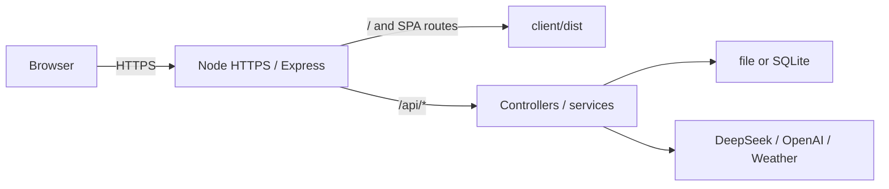

# 生产部署说明

本文覆盖本阶段的单机/局域网正式运行方式：Node HTTPS 直接终止 TLS，Express 同源托管 React 构建和 `/api/*`。项目没有登录、多用户隔离和公网防护，因此不应直接作为匿名公网服务暴露。

直接在宿主机运行 Node 的流程见本文；使用单 Node 容器时见 [Docker 部署说明](docker-deployment.md)。两种方式使用相同的 Express、HTTPS、API 和存储协议，不能同时写入同一份会话数据。

## 启动拓扑



## 前置条件

- Node.js `>=22.18.0` 与 pnpm。
- 已填写且未提交的 `server/.env`。
- 可读的证书和私钥；私钥建议权限 `600`。
- 数据目录有写权限，并已制定备份策略。

本机已有：

- `~/devhttps/dev-cert.pem`
- `~/devhttps/dev-key.pem`

当前证书有效期为 2026-08-01 至 2028-11-01，SAN 覆盖 `localhost`、loopback 和 `192.168.0.100` 至 `192.168.0.125`。它由本机 mkcert CA 签发，只适合已信任该 CA 的本机/局域网设备，不适用于公共域名或未安装该 CA 的客户端。

## 配置

生产模式的默认值：

```dotenv
NODE_ENV=production
HOST=0.0.0.0
PORT=7001
SERVE_CLIENT_BUILD=true
HTTPS_ENABLED=true
HTTPS_CERT_PATH=~/devhttps/dev-cert.pem
HTTPS_KEY_PATH=~/devhttps/dev-key.pem
```

可选变量：

- `CLIENT_DIST_DIR`：默认仓库内 `client/dist`。
- `HTTPS_CA_PATH`：需要额外 CA chain 时设置。
- `SERVE_CLIENT_BUILD=false`：仅在外部静态站点接管前端时使用。
- `HTTPS_ENABLED=false`：仅在受信反向代理已终止 TLS 时使用，Node 端口不得直接暴露公网。

模型、天气和存储变量沿用 `server/.env.example`。密钥、证书私钥和真实 `.env` 均不得提交。

## 构建与启动

```bash
pnpm install --frozen-lockfile
pnpm run audit:production
pnpm run build
pnpm run start:production
```

启动顺序会先校验：

1. 模型与存储运行配置；
2. `client/dist/index.html` 是否存在；
3. 证书和私钥是否可读；
4. 证书是否在有效期内；
5. 私钥是否与证书匹配。

任一项失败即退出，不会退回明文 HTTP。

依赖由根 pnpm workspace 和单一 `pnpm-lock.yaml` 管理。`audit:production` 覆盖 client/server 的全部生产依赖；高级别已知漏洞会使门禁失败。

## 验证

在已信任 mkcert CA 的本机执行：

```bash
curl --fail --show-error https://localhost:7001/
curl --fail --show-error https://localhost:7001/api/runtime-config
```

浏览器还应验证：

- 首屏和刷新后的 SPA 路径都返回 React 页面；
- `/api/not-a-route` 返回 JSON 404，而非 `index.html`；
- `/assets/*` 有 `immutable` 缓存，HTML 是 `no-cache`；
- HTTPS 响应包含 HSTS、`nosniff` 和 frame 防护头；
- ask、停止、模型/推理强度、搜索和导入导出通过既有 CDP mock 回归。

## 运维边界

- 启动前备份 `CONVERSATION_DATA_DIR` 或 SQLite 文件。
- 使用 launchd、systemd 或受控进程管理器负责开机启动、崩溃重启和日志轮转；仓库不绑定具体平台。
- 证书续期或主机/IP 变化后替换证书并重启，启动校验只检查有效期和密钥匹配，不负责自动续期。
- 公网部署必须另配真实域名 CA 证书、登录鉴权、限流、防火墙/WAF、可信代理与审计日志；这些不属于当前个人产品范围。

## 回滚

若新版本启动失败：

1. 保留当前会话数据，不运行清理或迁移命令；
2. 恢复上一份已验证源码/构建；
3. 继续使用相同 `server/.env` 和数据目录；
4. 重新执行静态检查、单测、构建和 HTTPS 冒烟。

React 切换未改变 file/SQLite 数据协议，因此本阶段回滚不需要数据格式回退。
