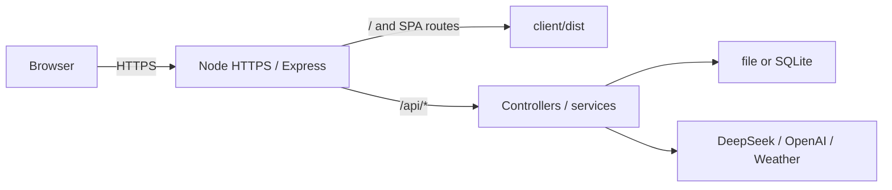

# 生产部署说明

本文覆盖本阶段的单机/局域网正式运行方式：Node HTTPS 直接终止 TLS，Express 同源托管 React 构建和 `/api/*`，并启用单个固定用户认证。项目没有注册、角色、多用户隔离、WAF 和公网运营防护，因此不应直接暴露为公共互联网服务。

直接在宿主机运行 Node 的流程见本文；使用单 Node 容器时见 [Docker 部署说明](docker-deployment.md)。两种方式使用相同的 Express、HTTPS、API 和存储协议，不能同时写入同一份会话数据。

## 启动拓扑



## 前置条件

- Node.js `>=22.18.0` 与 pnpm。
- 已填写且未提交的 `server/.env`。
- 已生成 Argon2id 密码哈希和两组不同的 JWT secret；生产不接受明文密码或缺失认证配置。
- 可读的证书和私钥；私钥建议权限 `600`。
- 数据目录有写权限，并已制定备份策略。

仓库默认示例路径：

- `~/devhttps/dev-cert.pem`
- `~/devhttps/dev-key.pem`

部署前必须按目标机器实际证书检查有效期与 SAN，不能依赖文档中的历史 IP：

```bash
openssl x509 -in ~/devhttps/dev-cert.pem -noout -dates -ext subjectAltName
```

使用 mkcert 时，证书只适合已信任对应根 CA 的本机/局域网设备，不适用于公共域名或未安装该 CA 的客户端。局域网通过 IP 访问时，SAN 必须包含目标机器当前 IP。

## 配置

生产模式的默认值：

```dotenv
NODE_ENV=production
HOST=0.0.0.0
PORT=7001
SERVE_CLIENT_BUILD=true
HTTPS_ENABLED=true
HTTPS_CERT_PATH=~/devhttps/dev-cert.pem
HTTPS_KEY_PATH=~/devhttps/dev-key.pem
AUTH_ENABLED=true
AUTH_COOKIE_SECURE=true
```

可选变量：

- `CLIENT_DIST_DIR`：默认仓库内 `client/dist`。
- `HTTPS_CA_PATH`：需要额外 CA chain 时设置。
- `SERVE_CLIENT_BUILD=false`：仅在外部静态站点接管前端时使用。
- `HTTPS_ENABLED=false`：仅在受信反向代理已终止 TLS 时使用，Node 端口不得直接暴露公网。

模型、天气和存储变量沿用 `server/.env.example`。密钥、证书私钥和真实 `.env` 均不得提交。

认证配置先通过本地 CLI 生成，再手工填入 `.env`：

```bash
pnpm --dir server auth:hash-password
pnpm --dir server auth:generate-secrets
```

至少配置 `AUTH_USERNAME`、`AUTH_PASSWORD_HASH`、`AUTH_ACCESS_TOKEN_SECRET` 和
`AUTH_REFRESH_TOKEN_SECRET`。两个 secret 必须不同且各自至少 32 字节。认证 Session
默认保存在 `CONVERSATION_DATA_DIR/auth-sessions.sqlite3`，应与会话数据一起备份。

## 构建与启动

```bash
pnpm install --frozen-lockfile
pnpm run audit:production
pnpm run build
pnpm run start:production
```

启动顺序会先校验：

1. 模型、存储和认证运行配置；
2. production 认证是否同时启用 HTTPS 与 Secure Cookie；
3. `client/dist/index.html` 是否存在；
4. 证书和私钥是否可读；
5. 证书是否在有效期内；
6. 私钥是否与证书匹配。

任一项失败即退出，不会退回明文 HTTP。

依赖由根 pnpm workspace 和单一 `pnpm-lock.yaml` 管理。`audit:production` 覆盖 client/server 的全部生产依赖；高级别已知漏洞会使门禁失败。

## 验证

在已信任 mkcert CA 的本机执行：

```bash
curl --fail --show-error https://localhost:7001/
curl --fail --show-error https://localhost:7001/api/health
```

浏览器还应验证：

- 首屏和刷新后的 SPA 路径都返回 React 页面；
- 未登录时受保护 API 返回结构化 JSON 401，健康检查保持公开；
- 登录成功后 `/api/not-a-route` 返回 JSON 404，而非 `index.html`；
- Access Token 不进入 Web Storage，Refresh Cookie 为 HttpOnly/Secure/SameSite=Strict；
- 刷新恢复、401 单次重放、退出和重新登录均可用；
- `/assets/*` 有 `immutable` 缓存，HTML 是 `no-cache`；
- HTTPS 响应包含 HSTS、`nosniff` 和 frame 防护头；
- ask、停止、模型/推理强度、搜索和导入导出通过既有 CDP mock 回归。

## 运维边界

- 启动前备份完整 `CONVERSATION_DATA_DIR`，同时覆盖会话和认证 Session SQLite/WAL。
- 怀疑 Refresh Token 泄漏时运行 `pnpm --dir server auth:revoke-all` 或轮换 Refresh secret；两种方式都会要求重新登录。
- 使用 launchd、systemd 或受控进程管理器负责开机启动、崩溃重启和日志轮转；仓库不绑定具体平台。
- 证书续期或主机/IP 变化后替换证书并重启，启动校验只检查有效期和密钥匹配，不负责自动续期。
- 公网部署仍需真实域名 CA 证书、分布式限流、防火墙/WAF、可信代理与审计日志；当前单用户登录不覆盖这些平台能力。

## 回滚

若新版本启动失败：

1. 保留当前会话数据，不运行清理或迁移命令；
2. 恢复上一份已验证源码/构建；
3. 继续使用相同 `server/.env` 和完整数据目录；若回滚到 R20 之前版本，旧应用会忽略独立认证库，但 API 将重新变为未认证访问；
4. 重新执行静态检查、单测、构建和 HTTPS 冒烟。

R20 未改变聊天 file/SQLite 数据协议。认证库是独立文件，不需要迁移回退；紧急设置 `AUTH_ENABLED=false` 会重新开放局域网 API，只能作为明确记录的短时降级。
